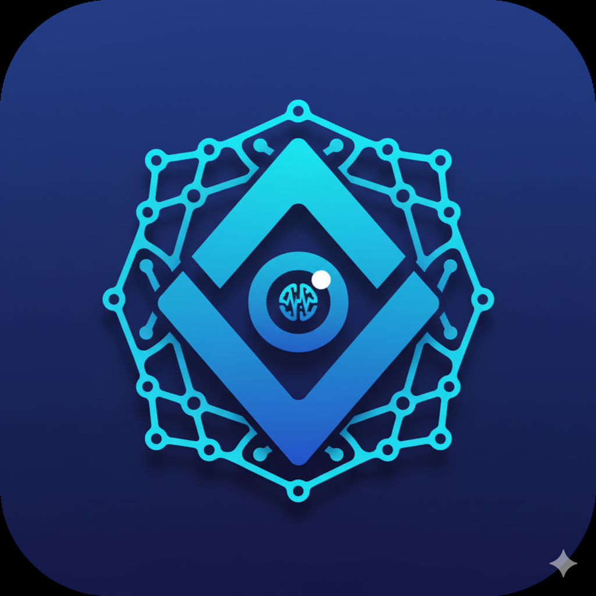

# Web Navigator AI

An intelligent AI-powered web navigation and data discovery platform that transforms how you search, compare, and analyze information across multiple sources.



## Features

- **AI Agent Pipeline**: Advanced multi-step AI processing with real-time status tracking
- **Intelligent Search**: Natural language processing for smart data discovery
- **Smart Comparisons**: AI-powered product and service comparisons
- **Real-time Analytics**: Instant insights and data visualizations
- **Dark/Light Theme**: Beautiful, responsive UI with theme switching
- **Mobile Responsive**: Optimized for all device sizes
- **Fast Performance**: Built with Vite and modern React patterns

## Quick Start

### Prerequisites

- **Node.js** (v18 or higher)
- **npm** or **yarn** or **bun** package manager

### Installation

1. **Clone the repository**
   ```bash
   git clone <repository-url>
   cd web-navi-spark
   ```

2. **Install dependencies**
   ```bash
   npm install
   # or
   yarn install
   # or
   bun install
   ```

3. **Start the development server**
   ```bash
   npm run dev
   # or
   yarn dev
   # or
   bun dev
   ```

4. **Open your browser**
   Navigate to `http://localhost:8080` to see the application.

## Available Scripts

| Command | Description |
|---------|-------------|
| `npm run dev` | Start development server |
| `npm run build` | Build for production |
| `npm run build:dev` | Build in development mode |
| `npm run preview` | Preview production build |
| `npm run lint` | Run ESLint for code quality |

## Project Structure

```
web-navi-spark/
├── public/                 # Static assets
│   ├── logo.png           # Application logo
│   ├── favicon.ico        # Browser favicon
│   └── placeholder.svg    # Placeholder images
├── src/
│   ├── components/        # Reusable UI components
│   │   ├── ui/           # shadcn/ui components
│   │   ├── AgentFlow.tsx # AI agent pipeline visualization
│   │   ├── Navigation.tsx # Main navigation component
│   │   ├── QueryInput.tsx # Search input component
│   │   ├── SearchResults.tsx # Results display
│   │   └── ThemeToggle.tsx # Theme switcher
│   ├── context/          # React context providers
│   │   ├── AgentState.tsx # AI agent state management
│   │   └── ThemeContext.tsx # Theme management
│   ├── hooks/            # Custom React hooks
│   ├── lib/              # Utility functions
│   ├── pages/            # Application pages
│   │   ├── Index.tsx     # Landing page
│   │   ├── Dashboard.tsx # Main dashboard
│   │   ├── Comparison.tsx # Comparison tools
│   │   ├── Analytics.tsx # Analytics dashboard
│   │   └── Login.tsx     # Authentication
│   ├── App.tsx           # Main application component
│   └── main.tsx          # Application entry point
├── package.json          # Dependencies and scripts
├── tailwind.config.ts    # Tailwind CSS configuration
├── vite.config.ts        # Vite build configuration
└── tsconfig.json         # TypeScript configuration
```

## Tech Stack

### Frontend
- **React 18** - Modern React with hooks and concurrent features
- **TypeScript** - Type-safe JavaScript development
- **Vite** - Fast build tool and development server
- **Tailwind CSS** - Utility-first CSS framework
- **shadcn/ui** - Beautiful, accessible UI components
- **Radix UI** - Headless UI primitives
- **Lucide React** - Beautiful icon library

### State Management & Data
- **React Query** - Server state management and caching
- **React Router** - Client-side routing
- **React Hook Form** - Form handling and validation
- **Zod** - Schema validation

### Development Tools
- **ESLint** - Code linting and quality
- **PostCSS** - CSS processing
- **Autoprefixer** - CSS vendor prefixing

## AI Agent Pipeline

The application features a sophisticated AI agent pipeline with 5 distinct stages:

1. **Instruction Parser** - Converts natural language queries into actionable steps
2. **Navigator** - Controls browser automation and web search
3. **Extractor** - Scrapes and extracts product details and data
4. **Comparator/Ranking** - Analyzes and ranks results by value
5. **Summarizer** - Generates pros/cons and comprehensive summaries

## Key Pages

### Home (`/`)
- Hero section with feature highlights
- Statistics and performance metrics
- Call-to-action sections

### Dashboard (`/dashboard`)
- Main control panel for AI operations
- Real-time agent status monitoring
- Query history and results

### Comparison (`/comparison`)
- Side-by-side product comparisons
- AI-powered analysis and recommendations
- Detailed feature breakdowns

### Analytics (`/analytics`)
- Data visualization and insights
- Performance metrics and trends
- Export capabilities

## Theming

The application supports both light and dark themes with:
- CSS custom properties for consistent theming
- Smooth theme transitions
- System preference detection
- Manual theme toggle

## Responsive Design

- Mobile-first approach
- Breakpoint-optimized layouts
- Touch-friendly interactions
- Adaptive navigation

## Configuration

### Environment Variables
Create a `.env` file in the root directory:

```env
VITE_API_URL=your_api_url_here
VITE_APP_NAME=Web Navigator AI
```

### Vite Configuration
The project uses Vite with:
- React SWC plugin for fast compilation
- Path aliases (`@/` for `src/`)
- Development server on port 8080
- Component tagging for development

## Deployment

### Build for Production
```bash
npm run build
```

### Preview Production Build
```bash
npm run preview
```

### Deploy to Vercel
```bash
npm install -g vercel
vercel --prod
```

### Deploy to Netlify
```bash
npm run build
# Upload dist/ folder to Netlify
```

## Contributing

1. Fork the repository
2. Create a feature branch (`git checkout -b feature/amazing-feature`)
3. Commit your changes (`git commit -m 'Add amazing feature'`)
4. Push to the branch (`git push origin feature/amazing-feature`)
5. Open a Pull Request

## License

This project is licensed under the MIT License - see the [LICENSE](LICENSE) file for details.

## Support

If you encounter any issues or have questions:

1. Check the [Issues](https://github.com/your-repo/issues) page
2. Create a new issue with detailed information
3. Contact the development team

## Acknowledgments

- [shadcn/ui](https://ui.shadcn.com/) for the beautiful component library
- [Radix UI](https://www.radix-ui.com/) for accessible primitives
- [Lucide](https://lucide.dev/) for the icon set
- [Tailwind CSS](https://tailwindcss.com/) for the utility-first CSS framework

---

